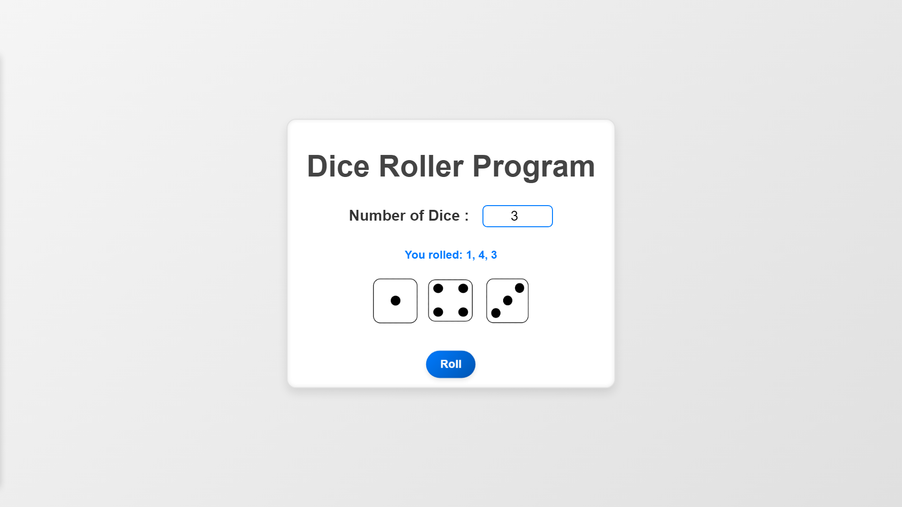

# Dice Roller Program

## Description
### EN 
This project is a simple dice roller application.         
It allows you to roll one or more dice and get random numbers.      

### FR 
Ce projet est une application de lanceur de dés.     
Il permet de lancer un ou plusieurs dés et d'obtenir des nombres aléatoires.   

## Features | Fonctionnalités
### EN 
- Roll one or more dice to get random numbers
- Display the rolled numbers
- Choose the number of dice to roll
### FR 
- Lancer un ou plusieurs dés pour obtenir des nombres aléatoires
- Afficher les nombres obtenus
- Choisir le nombre de dés à lancer

## Screenshot | Aperçu

